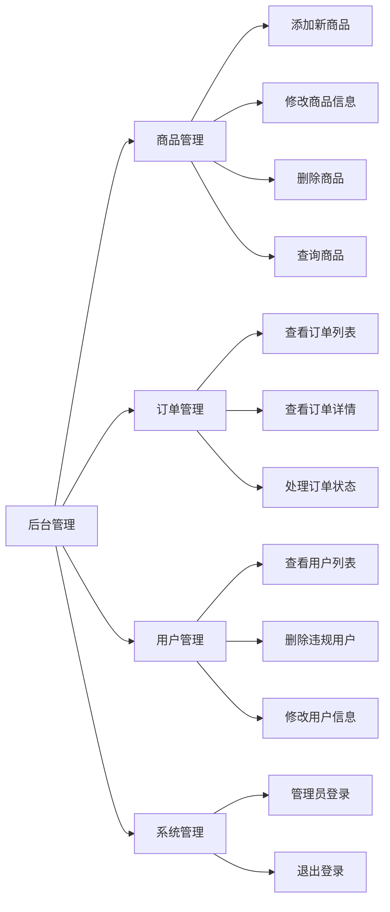

# 电商购物平台 (Java Web 课程设计)

## 概述
**本电子商务系统构建了一个全方位的在线购物与管理平台，旨在连接消费者与优质商品，打破地域限制，实现随时随地的便捷交易。在这个数字化商城中，用户可以享受到流畅的购物体验：从浏览丰富多样的商品展示，到查看详尽的规格参数，再到一键加入购物车完成下单，整个流程简单直观。系统不仅支持用户管理个人资料和查看历史订单，还提供了安全的登录注册机制，保障用户信息的私密性。对于平台运营者，系统提供了一个强大的后台管理中心。管理员可以轻松地进行商品的全生命周期管理，包括新品上架、信息更新及库存维护；同时，能够实时监控和处理用户订单，高效管理会员信息，确保业务的顺畅运转。无论是寻找心仪好物的普通消费者，还是追求高效运营的商家，本系统都能提供稳定、可靠且功能丰富的服务支持，打造了一个集展示、交易、管理于一体的现代化电子商务生态圈。**

## 系统功能结构
该系统包括用户前台模块、后台管理模块等。其中，用户前台模块实现了商品浏览、购物车管理、订单结算及个人中心管理功能。用户可以方便地注册登录，浏览各类商品详情，将心仪商品加入购物车并完成支付，同时支持查看历史订单和修改个人信息。后台管理模块实现了对商城核心数据的全面管控。管理员可以进行商品管理，包括商品的上架、编辑和下架；订单管理，实时查看和处理用户订单；以及用户管理，维护会员信息，确保平台秩序。后台管理功能结构图如图。



## 2. 系统详细设计

本系统严格遵循 **MVC (Model-View-Controller)** 软件架构模式进行开发，实现了业务逻辑、数据模型与用户界面的有效分离，提高了代码的可维护性和可扩展性。后端采用 **Spring MVC** 框架作为控制器核心，数据访问层采用 **DAO (Data Access Object)** 模式对数据库操作进行封装。

### 2.1 用户管理模块设计
用户管理模块是电子商务系统的基石，主要负责用户的身份认证与信息维护。
*   **设计范式**：采用 **Session 会话管理机制**。
*   **功能实现**：
    *   **身份认证 (Authentication)**：系统通过 `AuthController` 接收用户的登录请求。在 Service 层（或直接在 Controller 层调用 DAO）比对数据库中加密存储的凭证。验证通过后，将 `User` 对象序列化并存储至服务器端的 `HttpSession` 中，以此作为用户已登录的凭证，实现跨页面的状态保持。
    *   **注册与校验**：注册流程引入了严格的数据校验机制。在写入数据库前，系统会通过 `UserDAO` 检查用户名的唯一性，防止数据冲突。
    *   **个人信息管理**：提供用户修改个人资料（如联系方式、密码）的接口，所有更新操作均通过事务保证数据的一致性。

### 2.2 商品管理模块设计
商品管理模块实现了电商平台核心资源的数字化管理，涵盖了商品的展示与后台维护。
*   **设计范式**：**DAO 模式** 与 **RESTful 风格设计**（部分）。
*   **功能实现**：
    *   **数据持久化**：通过 `ProductDAO` 封装了所有针对 `products` 表的 CRUD（增删改查）操作，屏蔽了底层 JDBC 的复杂性，向上层提供简洁的 Java 方法调用接口。
    *   **多媒体资源处理**：针对商品图片的上传，系统利用 Servlet 的 Multipart 请求处理能力。图片文件被物理存储在服务器文件系统中，而数据库仅保存相对路径引用。这种“存取分离”的策略有效减轻了数据库的存储压力。
    *   **动态展示**：前台页面采用 JSP 技术结合 JSTL 标签库，根据后端传递的 `List<Product>` 数据模型动态渲染商品列表，支持按分类筛选与模糊搜索。

### 2.3 订单管理模块设计
订单管理模块是交易流程的核心，涉及复杂的业务逻辑和多表关联操作。
*   **设计范式**：**事务管理 (Transaction Management)** 与 **状态机模式**。
*   **功能实现**：
    *   **购物车机制**：购物车采用 **Session 级缓存** 策略。用户的临时购物项 (`CartItem`) 存储在内存 Session 中，而非直接写入数据库。这不仅减少了数据库的 I/O 压力，还提升了用户操作的响应速度。仅在最终结算时，数据才会被持久化。
    *   **原子性事务**：下单操作是一个典型的原子性事务。系统必须确保“生成订单记录”与“插入订单详情项”这两个操作要么同时成功，要么同时失败回滚，以维护数据的完整性。
    *   **状态流转**：订单状态（待付款、已付款、已发货、已完成）的管理遵循有限状态机逻辑，确保订单只能按照预定义的业务流程流转，防止状态跳跃导致的逻辑错误。

### 2.4 系统管理模块设计
系统管理模块主要面向运维与运营人员，重点在于权限控制与系统监控。
*   **设计范式**：**RBAC (Role-Based Access Control) 基于角色的访问控制** 与 **拦截器模式 (Interceptor Pattern)**。
*   **功能实现**：
    *   **权限拦截**：系统核心安全机制由 `AdminInterceptor` 实现。该拦截器配置在 Spring MVC 的拦截链中，专门拦截所有 `/admin/**` 路径的请求。它会检查当前 Session 中的用户对象是否存在且 `role` 字段是否标记为管理员（如 `role=1`）。若权限不足，请求将被强制重定向至登录页，从而在网关层面保障了后台系统的安全。
    *   **统一管理视图**：后台 Dashboard 聚合了各子模块的管理入口，提供了可视化的数据概览，便于管理员快速响应业务需求。

## 3. 数据库设计

数据库设计是系统稳定运行的基础。本系统采用 MySQL 关系型数据库，设计了多张核心数据表以支撑业务流转。

### 3.1 概念模型设计 (E-R 图)
系统主要实体包括：**用户 (User)**、**商品 (Product)**、**订单 (Order)** 和 **订单项 (OrderItem)**。
- **用户**与**订单**之间存在**一对多**关系（一个用户可以创建多个订单）。
- **订单**与**商品**之间通过**订单项**建立**多对多**关系（一个订单包含多个商品，一个商品可被多个订单包含）。
- **商品**属于**分类**，存在**多对一**关系。

### 3.2 物理表结构设计

#### 3.2.1 用户表 (users)
| 字段名 | 类型 | 长度 | 约束 | 描述 |
| :--- | :--- | :--- | :--- | :--- |
| id | INT | 11 | PK, AI | 用户ID |
| username | VARCHAR | 50 | UNIQUE | 用户名 |
| password | VARCHAR | 255 | NOT NULL | 加密密码 |
| email | VARCHAR | 100 | | 电子邮箱 |
| phone | VARCHAR | 20 | | 联系电话 |
| role | INT | 1 | DEFAULT 0 | 角色 (0:普通用户, 1:管理员) |

#### 3.2.2 商品表 (products)
| 字段名 | 类型 | 长度 | 约束 | 描述 |
| :--- | :--- | :--- | :--- | :--- |
| id | INT | 11 | PK, AI | 商品ID |
| name | VARCHAR | 100 | NOT NULL | 商品名称 |
| description | TEXT | | | 商品描述 |
| price | DECIMAL | 10,2 | NOT NULL | 价格 |
| stock | INT | 11 | DEFAULT 0 | 库存数量 |
| category_id | INT | 11 | FK | 所属分类ID |
| image | VARCHAR | 255 | | 图片路径 |

#### 3.2.3 订单表 (orders)
| 字段名 | 类型 | 长度 | 约束 | 描述 |
| :--- | :--- | :--- | :--- | :--- |
| id | INT | 11 | PK, AI | 订单ID |
| user_id | INT | 11 | FK | 下单用户ID |
| total_amount | DECIMAL | 10,2 | NOT NULL | 订单总金额 |
| status | INT | 1 | DEFAULT 1 | 状态 (1:待付款, 2:已付款, 3:已发货, 4:已完成) |
| created_at | DATETIME | | DEFAULT NOW | 下单时间 |
| address | VARCHAR | 255 | NOT NULL | 收货地址 |

#### 3.2.4 订单项表 (order_items)
| 字段名 | 类型 | 长度 | 约束 | 描述 |
| :--- | :--- | :--- | :--- | :--- |
| id | INT | 11 | PK, AI | 主键ID |
| order_id | INT | 11 | FK | 所属订单ID |
| product_id | INT | 11 | FK | 商品ID |
| quantity | INT | 11 | NOT NULL | 购买数量 |
| price | DECIMAL | 10,2 | NOT NULL | 购买时单价 |

## 功能特性

### 用户模块
- **注册与登录**：安全的用户账号创建与身份验证。
- **个人信息管理**：修改个人信息（邮箱、电话、密码）。
- **我的订单**：查看个人历史订单及状态。

### 商品模块
- **商品浏览**：按分类查看商品。
- **搜索功能**：支持按名称或描述搜索商品。
- **商品详情**：查看商品详细信息、价格和库存。

### 购物车模块
- **加入购物车**：将商品添加到购物车并指定数量。
- **购物车管理**：更新商品数量或移除商品。
- **会话保持**：购物车数据在用户会话期间保持。

### 订单模块
- **结账下单**：填写收货信息并提交订单。
- **订单追踪**：追踪订单状态（待付款、已付款、已发货等）。

### 后台管理模块
- **仪表盘**：系统状态概览。
- **商品管理**：添加、编辑和删除商品（支持图片上传）。
- **订单管理**：查看所有订单并更新发货状态。
- **用户管理**：查看已注册用户列表。
- **安全控制**：后台页面包含权限过滤器保护。

## 技术栈
- **前端**：HTML5, CSS3, JavaScript, Bootstrap 5
- **后端**：Java (JDK 8+), JSP, Servlet
- **数据库**：MySQL 5.7+
- **构建工具**：Maven
- **服务器**：Apache Tomcat 9+

## 项目结构
```
src/main/java/com/ecommerce/
├── config/       # 数据库配置 (DBUtil)
├── model/        # 实体类 (User, Product, Order 等)
├── dao/          # 数据访问对象 (数据库交互逻辑)
├── servlet/      # Servlet (控制器)
├── filter/       # 过滤器 (认证/授权)
└── util/         # 工具类
```

## 安装与运行

### 环境要求
- Java Development Kit (JDK) 8 或更高版本
- Apache Maven 3.6+
- MySQL Server 5.7+
- Apache Tomcat 9+ (或使用集成开发环境内置的 Tomcat 服务器)

### 数据库配置
1.  **创建数据库**：在 MySQL 中创建一个名为 `ecommerce_db` 的数据库。
    ```sql
    CREATE DATABASE ecommerce_db CHARACTER SET utf8mb4 COLLATE utf8mb4_unicode_ci;
    ```
2.  **导入初始数据**：执行项目根目录下的 `init.sql` 脚本，创建表结构并导入默认数据。
    ```bash
    mysql -u your_username -p ecommerce_db < init.sql
    ```
    - **默认管理员账号**：`admin` / `admin123`
3.  **更新数据库连接信息**：
    - 打开 `src/main/resources/db.properties` 文件。
    - 根据您的 MySQL 用户名和密码修改 `db.user` 和 `db.password`。
    - 如果 MySQL 服务器运行在非默认端口或非本地主机，请相应修改 `db.url`。

### 构建与部署

#### 方式一：使用 Maven 构建并手动部署
1.  **清理并打包项目**：在项目根目录下执行 Maven 命令。
    ```bash
    mvn clean package
    ```
    这将在 `target` 目录下生成一个名为 `ecommerce.war` 的部署文件。
2.  **部署到 Tomcat**：将生成的 `ecommerce.war` 文件复制到 Apache Tomcat 服务器的 `webapps` 目录下。
3.  **启动 Tomcat**：启动您的 Tomcat 服务器。Tomcat 会自动解压并部署 WAR 包。

#### 方式二：使用 IDE (如 IntelliJ IDEA) 运行
1.  **导入项目**：将本项目作为 Maven 项目导入您偏好的 IDE (例如 IntelliJ IDEA 或 Eclipse)。
2.  **配置 Tomcat 服务器**：
    - 在 IDE 中配置一个新的本地 Tomcat 服务器。
    - 对于 IntelliJ IDEA，在运行/调试配置中，添加一个新的 Tomcat Server -> Local 配置。
3.  **添加部署 Artifact**：
    - 在 Tomcat 配置的 "Deployment" 选项卡中，添加一个 Artifact。
    - 通常选择 `ecommerce:war exploded` (对于 IntelliJ IDEA) 或类似的 Web Application 部署选项。
4.  **启动应用**：启动 IDE 中配置的 Tomcat 服务器。

### 访问应用
项目成功部署并启动后，请在浏览器中访问以下地址：
```
http://localhost:8080/ecommerce/
```
(如果您的 Tomcat 运行在不同端口，请相应调整 `8080`)

## 许可证
本项目仅供学习交流使用。
